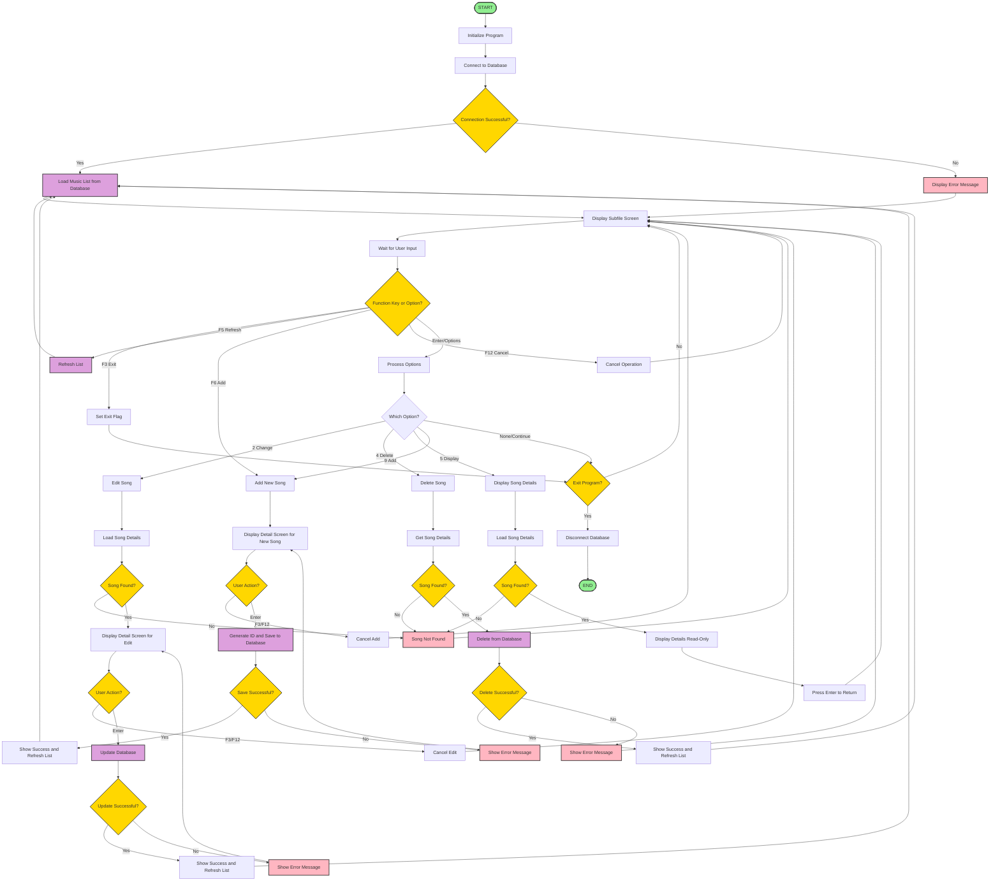

# Music Organizer RPG Program - Flowchart and Analysis

## Overview
This document contains the flowchart and detailed analysis of the Music Organizer RPG program (`MUSICPGM.SQLRPGLE`). The program provides a complete CRUD interface for managing a music database using IBM i RPG with SQL Server connectivity.

## Program Flowchart

## Program Flow Summary

The **Music Organizer RPG Program** follows this main flow:

### 1. Initialization Phase
- Program starts and connects to SQL Server database (`organiste`)
- Loads music records from the `Music` table into a subfile
- Displays the main subfile screen with music list

### 2. Main Processing Loop
The program enters a loop that continues until the user exits:
- **Display subfile screen** with current music records
- **Wait for user input** (function keys or subfile options)

### 3. Function Key Processing
- **F3**: Exit program
- **F5**: Refresh music list from database
- **F6**: Add new song
- **F12**: Cancel current operation
- **Enter**: Process selected subfile options

### 4. Subfile Option Processing
- **Option 2 (Change)**: Edit selected song details
- **Option 4 (Delete)**: Delete selected song from database
- **Option 5 (Display)**: View song details (read-only)
- **Option 9 (Add New)**: Add new song (alternative to F6)

### 5. Database Operations
- **Add Song**: Generate new ID, insert record, refresh list
- **Edit Song**: Load current data, allow changes, update database
- **Delete Song**: Remove record from database, refresh list
- **Display Song**: Show details in read-only mode

### 6. Error Handling
- SQL errors are caught and displayed to user
- Program-level errors are handled with monitor blocks
- Connection failures are reported with appropriate messages

### 7. Program Termination
- Disconnect from database
- Clean up resources and exit

## Key Program Components

### Main Procedures
1. **`main()`** - Entry point, coordinates overall program flow
2. **`connectToDatabase()`** - Establishes SQL Server connection
3. **`disconnectFromDatabase()`** - Closes database connection
4. **`loadMusicList()`** - Populates subfile with database records
5. **`displaySubfile()`** - Shows main screen and handles function keys
6. **`processUserActions()`** - Processes subfile options and function keys
7. **`addNewSong()`** - Handles new record creation
8. **`editSong()`** - Manages record updates
9. **`displaySong()`** - Shows read-only record details
10. **`deleteSong()`** - Removes records from database

### Database Schema
The program works with a `Music` table containing:
- **Id** (char(4)) - Primary key
- **SongId** (packed(4,0)) - Numeric identifier
- **SongName** (varchar(200)) - Song title
- **SongDescription** (varchar(500)) - Song description
- **SongCategory** (varchar(100)) - Music category
- **SongLink** (varchar(500)) - URL or link
- **SongAuthor** (varchar(200)) - Artist/author
- **CreatedDate** (date) - Creation timestamp
- **CreatedBy** (varchar(100)) - User who created record

### User Interface
The program uses two main screens defined in `MUSICDSPF.DSPF`:
1. **Subfile Screen (`SFLCTL`)** - Lists music records with options
2. **Detail Screen (`MUSICDETAIL`)** - Shows/edits individual record details

## Technical Features
- **SQL Server Integration** via ODBC connection
- **Subfile Processing** for list management
- **Error Handling** with monitor blocks
- **Transaction Management** for database operations
- **User-friendly Interface** with function key navigation
- **CRUD Operations** (Create, Read, Update, Delete)

The program demonstrates modern RPG programming practices including SQL integration, structured error handling, and modular procedure design while maintaining the traditional IBM i user interface paradigm.